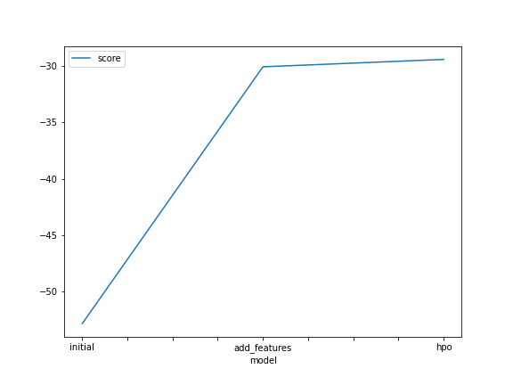
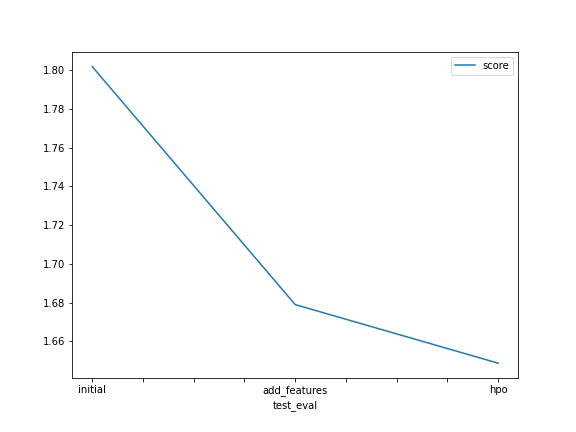

# Report: Predict Bike Sharing Demand with AutoGluon Solution
#### Sjoerd Visser

## Initial Training
### What did you realize when you tried to submit your predictions? What changes were needed to the output of the predictor to submit your results?
Negative values are not accepted. Therefore the values that are negative are changed into zero's.

### What was the top ranked model that performed?
WeightedEnsemble_L3 was the best model. 

## Exploratory data analysis and feature creation
### What did the exploratory analysis find and how did you add additional features?
The 'datetime' feature was changed into the hour per day as suggested by the exercise. Also the 'weather' and 'season' variables were changed into categorical variables. 
2w3
### How much better did your model preform after adding additional features and why do you think that is?
The model improved from 1.80184 to 1.6792. The reason is the model understands the categories and the time of day. 

## Hyper parameter tuning
### How much better did your model preform after trying different hyper parameters?
I tried to change a lot of hyper parameters, the only increase came from taking a higher training time. 

### If you were given more time with this dataset, where do you think you would spend more time?
Adding still more training time. Then work on individual models to see if the score would get better. 

### Create a table with the models you ran, the hyperparameters modified, and the kaggle score.
|model|time_limit|hyperparameters|num_trials|score|
|--|--|--|--|--|
|initial|600|n.a.|5|1.80184|
|add_features|600|n.a.|5|1.67902 |
|hpo|1200|See below|5|1.82301|
|hpo2|1200|n.a.|5|1.64879|
|hpo3|1200|n.a.|10|1.76315|

Parameters changed: 
- time_limit
- num_trials
- hyperparameters

hyperparameters = {
               'GBM': {'num_boost_round': 10000},
               'CAT': {'iterations': 10000},
               'XT': {'n_estimators': 300},
               
             

### Create a line plot showing the top model score for the three (or more) training runs during the project.

### Create a line plot showing the top kaggle score for the three (or more) prediction submissions during the project.

TODO: Replace the image below with your own.

## Summary

The first two steps are straightforward: load the data and train a model using Autogluon, then improve the data by adding additional features. 
When trying to change parameters, the model did not improve at all. My idea is that you should only limit Autogluon in the searchspace if you really know what models work well. By passing set parameters you constrain the search space and increase the chance of overfitting. 
One interesting finding is that the Neural Net was the best model when the time was increased to 20 minutes, while it performed worst when the time_limit was set to 10 minutes. It would be interesting to let Autogluon run for a day and continue with the best model from there. 

Questions I have:

- What other hyperparameters should you try to change? 
- Is 600 seconds enough to truely get a good view of what will work?

